| Name | ⠀Image⠀ | Upgraded image | Rarity | Type | Cost | Description |
| ---- | ----- | -------------- | ------ | ---- | ---- | ----------- |
| Charge | 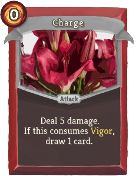 |  | Common | Attack | 0 | Deal 5 (7) damage. If this consumes Vigor, draw 1 (2) card(s). |
| Double Edge |  | 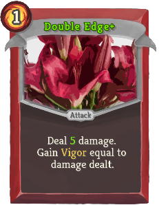 | Common | Attack | 1 | Deal 4 (5) damage. Gain Vigor equal to damage dealt. |
| Fury | 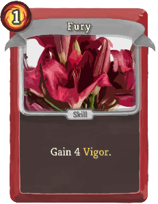 | 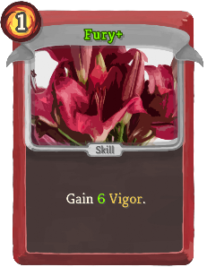 | Common | Skill | 1 | Gain 4 (6) Vigor. |
| Mob Mentality | 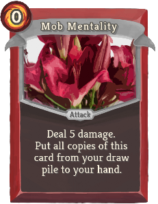 | 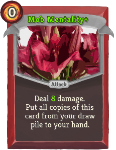 | Common | Attack | 0 | Deal 5 (8) damage. Put all copies of this card from your draw pile to your hand. |
| Strike Of The Fallen | 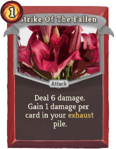 | 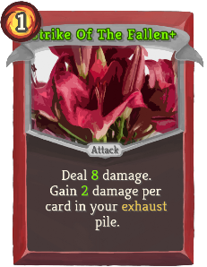 | Common | Attack | 1 | Deal 6 (8) damage. Gain 1 (2) damage per card in your exhaust pile. |
| Animosity | 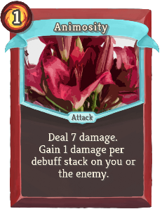 | 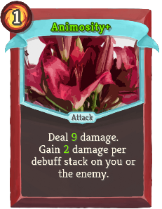 | Uncommon | Attack | 1 | Deal 7 (9) damage. Gain 1 (2) damage per debuff stack on you or the enemy. |
| Ashes To Ashes | 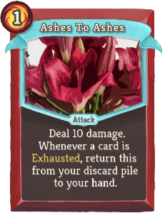 |  | Uncommon | Attack | 1 | Deal 10 (14) damage. Whenever a card is Exhausted, return this from your discard pile to your hand. |
| Blazing Sword |  | 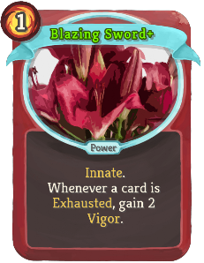 | Uncommon | Power | 1 | (Innate.)  Whenever a card is Exhausted, gain 2 Vigor. |
| Blood Barrier | 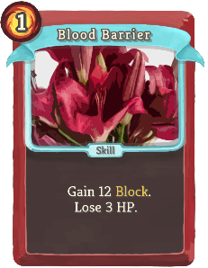 | 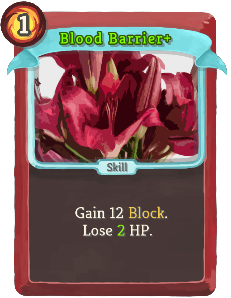 | Uncommon | Skill | 1 | Gain 12 Block. Lose 3 (2) HP. |
| Boiling Blood | 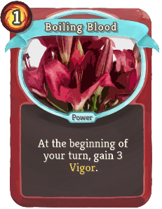 | 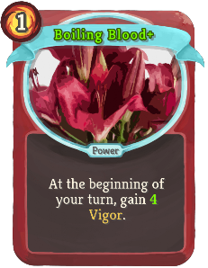 | Uncommon | Power | 1 | At the beginning of your turn, gain 3 (4) Vigor. |
| Grim | 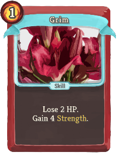 |  | Uncommon | Skill | 1 | Lose 2 HP. Gain 4 (5) Strength. |
| Revenge |  | 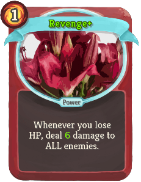 | Uncommon | Power | 1 | Whenever you lose HP, deal 4 (6) damage to ALL enemies. |
| Roar |  | 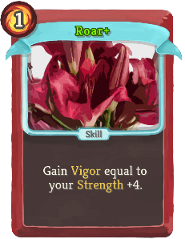 | Uncommon | Skill | 1 | Gain Vigor equal to your Strength (+4). |
| Scythe | 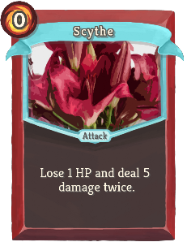 |  | Uncommon | Attack | 0 | Lose 1 HP and deal 5 damage twice (!M! times). |
| Strike Barrage | 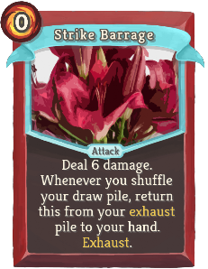 | 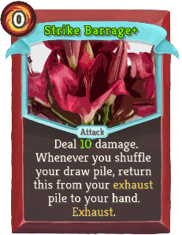 | Uncommon | Attack | 0 | Deal 6 (10) damage. Whenever you shuffle your draw pile, return this from your exhaust pile to your hand. Exhaust. |
| Tackle | 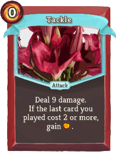 | 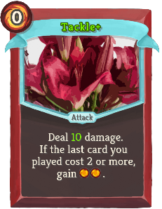 | Uncommon | Attack | 0 | Deal 9 (10) damage. If the last card you played cost 2 or more, gain [E] ([E]). |
| Topple | 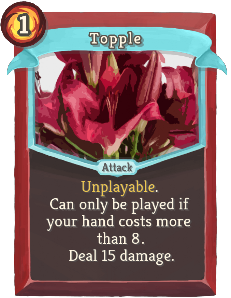 | 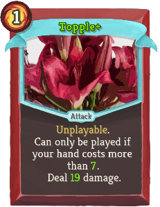 | Uncommon | Attack | 1 | Unplayable. Can only be played if your hand costs more than 8 (7). Deal 15 (19) damage. |
| Worsening | 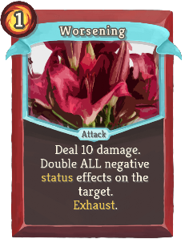 | 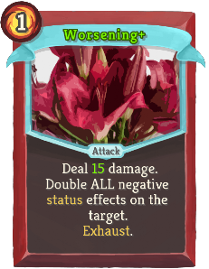 | Uncommon | Attack | 1 | Deal 10 (15) damage. Double ALL negative status effects on the target. Exhaust. |
| Abyss | 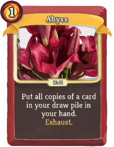 |  | Rare | Skill | 1 (0) | Put all copies of a card in your draw pile in your hand. Exhaust. |
| Desecration | 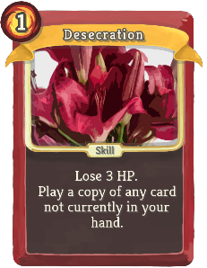 | 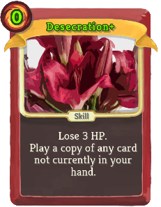 | Rare | Skill | 1 (0) | Lose 3 HP. Play a copy of any card not currently in your hand. |
| Gambit | 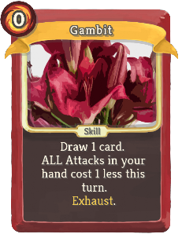 | 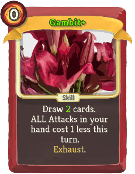 | Rare | Skill | 0 | Draw 1 (2) card(s). ALL Attacks in your hand cost 1 less this turn. Exhaust. |
| Mutilation | 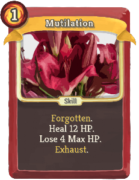 | 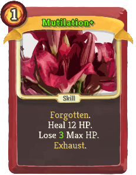 | Rare | Skill | 1 | boosterpacks:Forgotten. Heal 12 HP. Lose 4 (3) Max HP. Exhaust. |
| No More Remorse | 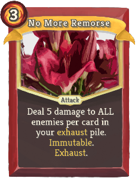 | 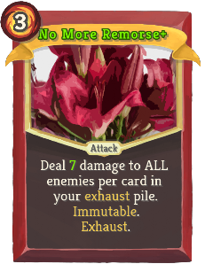 | Rare | Attack | 3 | Deal 5 (7) damage to ALL enemies per card in your exhaust pile. boosterpacks:Immutable. Exhaust. |
| Orpheus | 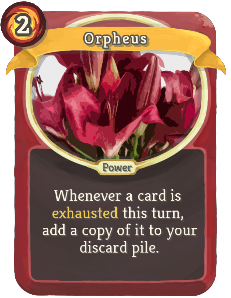 | 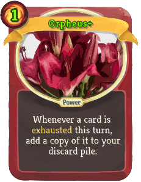 | Rare | Power | 2 (1) | Whenever a card is exhausted this turn, add a copy of it to your discard pile. |
| Reprieve | 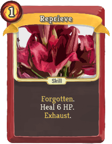 | 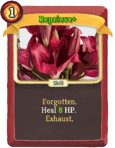 | Rare | Skill | 1 | boosterpacks:Forgotten. Heal 6 (8) HP. Exhaust. |
| Evasive Maneuver | 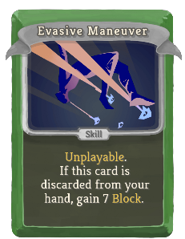 | 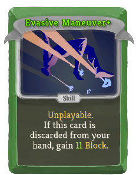 | Common | Skill |  | Unplayable. If this card is discarded from your hand, gain 7 (11) Block. |
| Gut Stab | 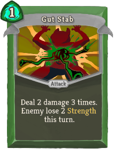 | 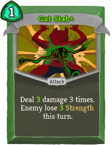 | Common | Attack | 1 | Deal 2 (3) damage 3 times. Enemy lose 2 (3) Strength this turn. |
| Hidden Strike | 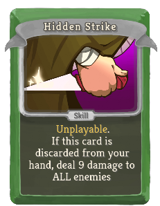 |  | Common | Skill |  | Unplayable. If this card is discarded from your hand, deal 9 (13) damage to ALL enemies |
| Instinct | 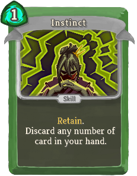 | 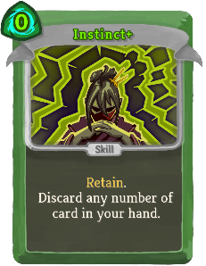 | Common | Skill | 1 (0) | Retain. Discard any number of card in your hand. |
| Phantom Strike | 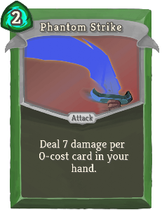 | 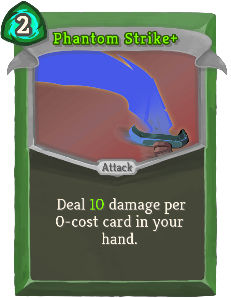 | Common | Attack | 2 | Deal 7 (10) damage per 0-cost card in your hand. |
| Sliding Kick |  |  | Common | Attack | 0 | Deal 7 (9) damage. Discard 1 (2) card(s). |
| Swiss Knife |  |  | Common | Attack | 1 | Deal damage equal to 2 (3) times the number of cards in your hand to ALL enemies. boosterpacks:Immutable. |
| Ambush |  |  | Uncommon | Skill | 1 | Add Shivs to your hand until you have 7 (9) cards in hand. Exhaust. |
| Corrosive Scent |  |  | Uncommon | Skill |  | Unplayable. If this card is discarded from your hand, apply 4 (6) Poison to ALL enemies. |
| Cry Of Despair |  |  | Uncommon | Skill |  | Unplayable. If this card is discarded from your hand, ALL enemies lose 3 (4) Strength this turn. |
| Dark Omen |  |  | Uncommon | Power | 1 | Whenever you apply Weak, apply 3 (4) Poison as well. |
| Keen Eyes |  |  | Uncommon | Skill |  | Unplayable. If this card is discarded from your hand, apply 2 (3) Weak to ALL enemies |
| Ninjutsu |  |  | Uncommon | Power | 0 | (Innate. All future) Shivs now gain Retain. Whenever you retain a Shiv, Upgrade it. |
| Secret Arsenal |  |  | Uncommon | Power | 1 (0) | Whenever you play a card that costs 2 energy or more, add 2 Shivs to your hand. |
| Shinobi |  |  | Uncommon | Skill |  | Unplayable. If this card is discarded from your hand, add 2 (3) Shivs to your hand. |
| Tactical Advantage |  |  | Uncommon | Attack | 1 | Deal 5 (6) damage. If the enemy does not have Poison, apply 8 (11) Poison. Exhaust. |
| Will to Kill |  |  | Uncommon | Skill | 0 | Apply 5 (6) Poison. Double this card potency and increase its cost by 1 for this combat. |
| Master Trick |  |  | Rare | Skill |  | Unplayable. If this card is discarded from your hand, add a card from your draw (or discard) pile to your hand. |
| Mastery |  |  | Rare | Power | 2 (1) | Whenever at least 2 Shivs are added to your hand, adds an additional one. |
| Mirage |  |  | Rare | Power | 1 | (Innate.)  Whenever you draw a non-Curse, non-Status unplayable card, draw 1 card. |
| Perfectionist |  |  | Rare | Attack | 0 | Deal 30 (40) damage. Cost is equal to the number of empty cards slots in your hand. |
| Shinigami |  |  | Rare | Power | 2 (1) | Whenever Poison is Fatal, heal 4 HP. |
| Underhanded Trick |  |  | Rare | Skill | 1 | Scry your entire draw pile. Exhaust. (not Exhaust.) |
| Matrix Inversion |  |  | Common | Attack | 1 | Deal 9 (13) damage. Invert the order of your Orbs. |
| Pointer |  |  | Common | Skill | 0 | Evoke your leftmost Orb (twice). |
| Polynomial |  |  | Common | Attack | X | Deal 4 (6) + 3 (4)X damage to ALL enemies. Costs only up to [B] . |
| Swift Claw |  |  | Common | Attack | 0 | Deal 2 (5) damage. Draw 1 card. |
| Arctic Wind |  |  | Uncommon | Power | 1 | (Innate.)  At the beginning of your turn, Channel 1 Frost. |
| Black Hole |  |  | Uncommon | Power | 2 (1) | Whenever a Dark is Evoked, trigger the passive ability of ALL Dark orbs. Channel 2 Dark. |
| Complex Plane |  |  | Uncommon | Power | X | Gain X Focus. Cost only up to [B] [B] (not [B]). |
| Conductive Strike |  |  | Uncommon | Attack | 1 | Deal 7 (11) damage. boosterpacks:Invoke a copy of your rightmost Orb. |
| Dark Mirror |  |  | Uncommon | Power | 1 | Gain 2 (3) Dark Focus. Channel 1 Dark. |
| Dictionary Attack |  |  | Uncommon | Attack | 2 | Deal 13 (18) damage. Look at the top 4 (6) cards of your deck. Choose one and add it to your hand. |
| Duck Typing |  |  | Uncommon | Skill | 1 (0) | Evoke all Orbs of the same type as your rightmost one. Draw 1 card per Orb Evoked. |
| Halting Problem |  |  | Uncommon | Skill | 1 | boosterpacks:Invoke a copy of each of your Orbs. End your turn. Exhaust. (not Exhaust.) |
| Multithreading |  |  | Uncommon | Power | 1 | (Innate.)  At the start of your turn, Evoke your rightmost Orb twice. |
| Nilpotency |  |  | Uncommon | Skill | 1 | Put 2 (3) 0-cost cards from your draw pile into your hand. |
| Piercing Claws |  |  | Uncommon | Attack | 1 | Deal 2 (4) damage twice. Increases the damage of ALL Claw cards by 1 this combat |
| Register |  |  | Uncommon | Skill | X | Draw X (X+1) cards. Costs only up to [B]. |
| Sharpening |  |  | Uncommon | Power | 1 | Increases the damage of ALL Claw cards by 5 (8) this combat. |
| Static Wave |  |  | Uncommon | Skill | 1 (0) | Activate the passive effect of each of your Orbs. Draw 1 card. |
| Elemental Storm |  |  | Rare | Skill | X | boosterpacks:Invoke a random non-Plasma X (X+1) times. Cost no energy. Exhaust. |
| Galvanic Aura |  |  | Rare | Power | 2 | (Innate.)  Whenever you Evoke a non-Lightning, boosterpacks:Invoke a Lightning. |
| Last Theorem |  |  | Rare | Attack | X | Deal X+3 (X+5) damage squared. boosterpacks:Immutable. Exhaust. |
| Midnight |  |  | Rare | Attack | 2 | boosterpacks:Latent. Deal 11 (14) damage. Gain damage equal to half of (not half of)your next Dark Evoke value. |
| Overflow |  |  | Rare | Skill | 4 (3) | Fills your hand with copies of a card in your hand. Exhaust. |
| Superconductor |  |  | Rare | Power | 1 | Whenever you Channel an Orb, boosterpacks:Invoke a copy of it. Lose 2 (1) Focus. |
| Twilight |  |  | Rare | Skill | 0 | boosterpacks:Latent. (not boosterpacks:Latent.) Channel 1 Dark per Orb slot. Exhaust. |
| Bravery |  |  | Common | Skill | 1 (0) | Retain. Enter boosterpacks:Courage. Exhaust. |
| Empty Intuition |  |  | Common | Skill | 1 | Scry 4 (5). Exit your Stance. |
| Fortune |  |  | Common | Skill | 0 | Retain. Scry 6 (8). Exhaust. |
| Friendship |  |  | Common | Skill | 0 | (Retain.)  At the end of this turn, Retain your entire hand. |
| Group Therapy |  |  | Common | Skill | 1 | ALL enemies lose HP equal to their Mark. Apply 7 (10) Mark to ALL enemies. |
| Mind Over Matter |  |  | Common | Skill | 1 | Draw 3 (4) cards. Discard 2 cards. Enter boosterpacks:Courage. |
| Pilgrimage |  |  | Common | Skill | 0 | (Retain.)  Gain 6 Mantra. End your turn. |
| Audacity |  |  | Uncommon | Skill | 0 | Draw 1 card. If you draw a Skill, enter boosterpacks:Courage. Exhaust. (not Exhaust.) |
| Blissful Ignorance |  |  | Uncommon | Power | 1 | Whenever you discard every card you Scry, gain 2 (3) Block per card Scried. |
| Defy Reality |  |  | Uncommon | Skill | 1 | Scry 5. Add 1 (2) Vision(s) to your hand. |
| Determination |  |  | Uncommon | Skill | 1 | If you are in boosterpacks:Courage, gain 10 (15) Block. If not, enter boosterpacks:Courage. |
| Empty Faith |  |  | Uncommon | Skill | 1 | Gain 3 (4) Mantra. Exit your Stance. |
| Forge Reality |  |  | Uncommon | Attack | 2 | Deal 8 (11) damage. Gain 8 (11) Block. Add a Smite and a Safety to your hand. |
| Free Will |  |  | Uncommon | Skill | 1 | Scry 3 (4). Draw as much cards as you discarded. |
| Providence |  |  | Uncommon | Power | 1 | Whenever you gain Mantra, gain 4 (6) Block. |
| Psychoanalysis |  |  | Uncommon | Power | 1 | At the start of your turn, apply 6 (9) Mark to ALL enemies and all enemies lose 6 (9) HP. |
| Threads Of Fate |  |  | Uncommon | Power | 1 | For every card you discard while you Scry, deal 2 (3) damage to a random enemy. |
| Valor |  |  | Uncommon | Skill | 1 | Scry 3 (5). Draw 1 card. Enter boosterpacks:Courage. |
| Collapse Reality |  |  | Rare | Skill | 0 | Exhaust ALL Colorless cards in your hand. Gain [E] and draw 1 card for each. Exhaust. (not Exhaust.) |
| Dominate Reality |  |  | Rare | Skill | 1 | Add 2 (3) Insights and Smites to your draw pile. Exhaust. |
| Encore |  |  | Rare | Power | 1 | (Innate.)  Whenever your turn is forced to end, draw 1 card, discard 2 cards and continue to play. |
| Oracle |  |  | Rare | Power | 1 | (Innate.)  Whenever you Scry, Scry 1 more card. |
| Prophecy |  |  | Rare | Power | 1 | Whenever you enter Divinity, put 1 (2) card(s) from your draw pile into your hand. |
| Reincarnation |  |  | Rare | Skill | X | Gain X (X+1) Strength. Gain X (X+1) Dexterity. End your turn. Exhaust. |
| Traumatize |  |  | Rare | Skill | 2 (1) | Retain. Enemy loses HP equal to their Mark. Double their Mark. |
| Dark Flames |  |  | Special | Attack | 1 | Deal 20 (30) damage to ALL enemies. |
| Defense |  |  | Special | Skill | 0 | Ethereal. Gain 2 (6) Block. Exhaust. |
| Offense |  |  | Special | Attack | 0 | Ethereal. Deal 2 (6) damage. Exhaust. |
| Vision |  |  | Special | Skill | 0 | Retain. Scry 2 (3). Exhaust. |
| Breakthrough |  |  | Uncommon | Power | 2 | Gain 2 (3) Strength. Gain 2 (3) Dexterity. Gain 2 (3) Focus. |
| Constant |  |  | Uncommon | Attack | 1 | Deal 6 (9) damage. Gain 6 (9) Block. boosterpacks:Immutable |
| Inner Demons |  |  | Uncommon | Attack | 1 | Deal 10 (14) damage. Gain 10 (14) Block. Add a random curse to your hand. |
| Memories |  |  | Uncommon | Skill | 0 | Exchange your discard pile and your draw pile. Exhaust. (not Exhaust.) |
| Blessing |  |  | Rare | Power | 1 (0) | boosterpacks:Latent. At the start of your turn, gain [E] . |
| Monad |  |  | Rare | Attack | 2 (1) | Deal damage equal to the number of cards currently in play. boosterpacks:Immutable. |
| Fragility |  |  | Curse | Curse |  | Unplayable. At the end of your turn, gain 1 Vulnerable. |
| Guilt |  |  | Curse | Curse |  | Unplayable. At the end of your turn, lose 2 HP. Whenever you shuffle your draw pile, return this to your hand. |
| Haunt |  |  | Curse | Curse | 1 | At the end of your turn, lose 6 HP. |
| Laziness |  |  | Curse | Curse |  | Unplayable. When drawn, lose [E] . Ethereal. |
| Terminal |  |  | Curse | Curse |  | Unplayable. When drawn, lose 2 HP. |
