| Name | Image | Upgraded image | Rarity | Type | Cost | Description |
| ---- | ----- | -------------- | ------ | ---- | ---- | ----------- |
| Charge |  |  | Common | Attack | 0 | Deal 4(7) damage. If this consumes Vigor, draw 1(2) card(s). |
| Double Edge | 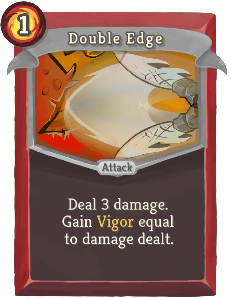 |  | Common | Attack | 1 | Deal 3(4) damage. Gain Vigor equal to damage dealt. |
| Fury |  |  | Common | Skill | 1 | Gain 4(6) Vigor. Draw 1 card. |
| Mob Mentality |  |  | Common | Attack | 0 | Deal 5(8) damage. Draw all copies of this card. |
| Sprint |  |  | Common | Skill | 1 | Gain 5(8) Block. Gain 2(3) Vigor. |
| Strike Of The Fallen |  |  | Common | Attack | 1 | Deal 6(7) damage. Deal 1(2) additional damage per card in your exhaust pile. |
| Animosity |  |  | Uncommon | Attack | 1 | Deal 5(8) damage. Deal 2 additional damage per debuff stack on you or the target. |
| Ashes |  |  | Uncommon | Attack | 0 | Deal 4(6) damage. Whenever a card is Exhausted, return this from your discard pile to your hand. |
| Blazing Sword |  |  | Uncommon | Power | 2 | (Innate.)  Whenever a card is Exhausted, gain 3 Vigor. |
| Blood Barrier |  |  | Uncommon | Skill | 1 | Gain 11(13) Block. Lose 3(2) HP. |
| Boiling Blood | 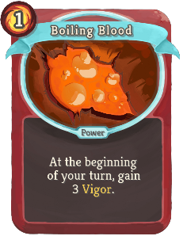 |  | Uncommon | Power | 1 | At the beginning of your turn, gain 3(4) Vigor. |
| Empty |  |  | Uncommon | Skill | 1 | Gain 13(18) Block. Add a *Void on top of your draw pile. |
| Frenzy |  |  | Uncommon | Skill | 1 | Lose 2 HP. Gain 6(9) Vigor. |
| Grim |  |  | Uncommon | Skill | 1 | Lose 3 (4) HP. Gain 3(5) Strength. |
| Revenge |  | 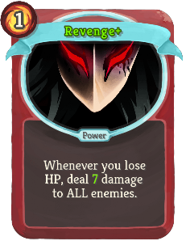 | Uncommon | Power | 1 | Whenever you lose HP, deal 5(7) damage to ALL enemies. |
| Scythe |  |  | Uncommon | Attack | 0 | Lose 1 HP and deal 5 damage 2(3) times. |
| Titanium |  |  | Uncommon | Skill | 1 | Gain 5 Block 2(3) times. |
| Worsening |  |  | Uncommon | Attack | 2 | boosterpacks:Latent. Deal 15(20) damage. Double ALL debuffs on the target. Exhaust. |
| Abyss |  |  | Rare | Skill | 1(0) | Choose a card in your draw pile, put it and all of its copies in your hand. Exhaust. |
| Desecration |  | 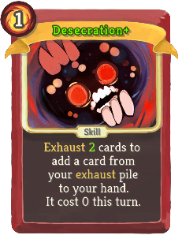 | Rare | Skill | 1 | Exhaust 3(2) cards to add a card from your exhaust pile to your hand. It cost 0 this turn. |
| Gambit |  |  | Rare | Skill | 0 | Draw 1(2) card(s). ALL Attacks in your hand cost 1 less this turn. Exhaust. |
| Mutilation |  |  | Rare | Skill | 1 | boosterpacks:Forgotten. Heal 10 HP. Lose 3(2) Max HP. Exhaust. |
| No More Remorse |  | 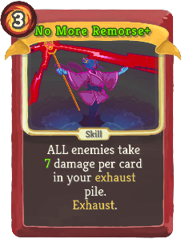 | Rare | Skill | 3 | ALL enemies take 5(7) damage per card in your exhaust pile. Exhaust. |
| Quagmire |  |  | Rare | Skill | 1 | Gain 16(21) Block. Add 3 *Debris into your hand. |
| Reprieve |  |  | Rare | Skill | 1 | boosterpacks:Forgotten. Heal 6(8) HP. Exhaust. |
| Evasive Maneuver |  |  | Common | Skill |  | Unplayable. If this card is discarded from your hand, gain 7(11) Block. |
| Gut Stab |  | 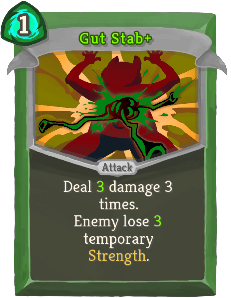 | Common | Attack | 1 | Deal 2(3) damage 3 times. Enemy lose 2(3) temporary Strength. |
| Hidden Strike |  |  | Common | Skill |  | Unplayable. If this card is discarded from your hand, deal 9(13) damage to ALL enemies |
| Honed Blade |  |  | Common | Attack | 1 | Deal 8(10) damage. Next turn, gain 2(3) temporary Strength. |
| Instinct |  |  | Common | Skill | 1(0) | Retain. Discard any number of cards from your hand. Exhaust. |
| Phantom Strike | 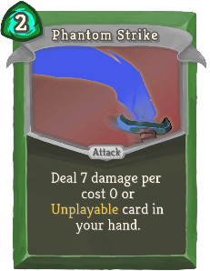 |  | Common | Attack | 2 | Deal 7(10) damage per cost 0 or Unplayable card in your hand. |
| Sliding Kick |  | 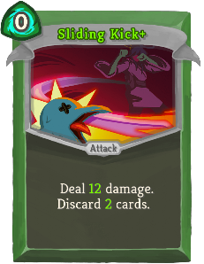 | Common | Attack | 0 | Deal 7(12) damage. Discard 1(2) card(s). |
| Ambivalent |  |  | Uncommon | Attack | 1 | Deal 5(6) damage twice. Discard 2(3) cards at random. Draw 2(3) cards. |
| Ambush | 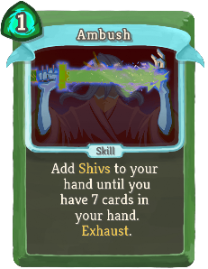 |  | Uncommon | Skill | 1 | Add *Shivs to your hand until you have 7(9) cards in your hand. Exhaust. |
| Black Death | 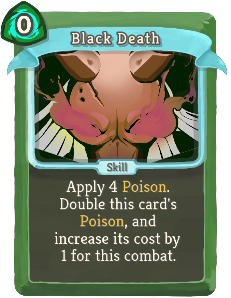 |  | Uncommon | Skill | 0 | Apply 4(5) Poison. Double this card's Poison, and increase its cost by 1 for this combat. |
| Corrosive Scent |  |  | Uncommon | Skill |  | Unplayable. If this card is discarded from your hand, apply 4(6) Poison to ALL enemies. |
| Cry Of Despair |  |  | Uncommon | Skill |  | Unplayable. If this card is discarded from your hand, ALL enemies lose 3(4) temporary Strength. |
| Mirage | 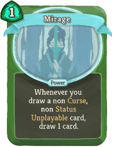 |  | Uncommon | Power | 1 | (Innate.)  Whenever you draw a non Curse, non Status Unplayable card, draw 1 card. |
| Ninjutsu |  |  | Uncommon | Power | 0 | (Innate.)  *Shivs gain Retain. When you Retain a *Shiv, Upgrade it. |
| Secret Arsenal |  |  | Uncommon | Power | 1(0) | Whenever you play a card that costs 2 energy or more, add 2 *Shivs to your hand. |
| Shinigami |  |  | Uncommon | Power | 1 | (Innate.)  Whenever Poison is Fatal, heal 6 HP. |
| Shinobi | 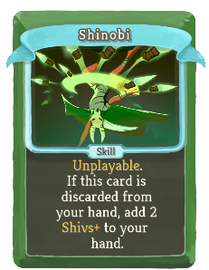 | 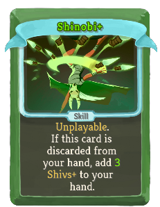 | Uncommon | Skill |  | Unplayable. If this card is discarded from your hand, add 2(3) *Shivs+ to your hand. |
| Silence |  |  | Uncommon | Skill | 0 | Discard your hand. Gain 2(3) Block per card discarded. Draw 1 card. |
| Somber Omen |  |  | Uncommon | Power | 1 | Whenever you apply Weak, apply 3(4) Poison as well. |
| Tactical Advantage |  |  | Uncommon | Attack | 1 | Deal 5(6) damage. If the enemy does not have Poison, apply 8(10) Poison. Exhaust. |
| Assassinate |  | 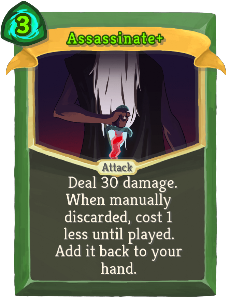 | Rare | Attack | 4(3) | Deal 30 damage. When manually discarded, cost 1 less until played. Add it back to your hand. |
| Killing Urge |  |  | Rare | Power | 1 | At the start of your turn, gain 2(3) *Accuracy. |
| Master Trick |  |  | Rare | Skill |  | Unplayable. If this card is discarded from your hand, put a card from your draw (or discard) pile to your hand. |
| Mastery |  |  | Rare | Power | 2(1) | Whenever at least 2 *Shivs are added to your hand, adds an additional one. |
| Sly Trick |  |  | Rare | Skill | 1(0) | Scry 99. Exhaust. |
| Conductive Strike |  |  | Common | Attack | 1 | Deal 5(7) damage. Evoke a copy of your rightmost Orb. |
| Dictionary Attack |  |  | Common | Attack | 2 | Deal 14(16) damage. Look at the top 3(5) cards of your deck, choose one and add it to your hand. |
| Matrix Inversion |  |  | Common | Attack | 1 | Deal 9(13) damage. Invert the order of your Orbs. |
| Nilpotency |  |  | Common | Skill | 1 | Put 2(3) cost 0 cards from your draw pile into your hand. |
| Pointer |  |  | Common | Skill | 0 | Evoke your leftmost Orb (twice). |
| Polynomial |  |  | Common | Attack | X | Deal 3(5) + 2(3)X damage to ALL enemies. Cannot drain more than [B] . |
| Swift Claw |  |  | Common | Attack | 0 | Deal 2(4) damage. Draw 1 card. |
| Targeting System | 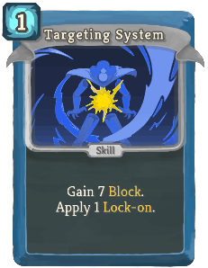 |  | Common | Skill | 1 | Gain 7(11) Block. Apply 1 Lock-on. |
| Arctic Wind |  |  | Uncommon | Power | 1 | (Innate.)  At the beginning of your turn, Channel 1 Frost. |
| Black Hole |  |  | Uncommon | Power | 2 | Whenever a Dark is Evoked, trigger the passive ability of ALL Dark orbs. Channel 2(3) Dark. |
| Dark Mirror |  | 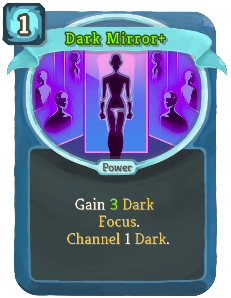 | Uncommon | Power | 1 | Gain 2(3) *Dark Focus. Channel 1 Dark. |
| Duck Typing | 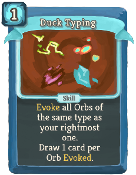 |  | Uncommon | Skill | 1(0) | Evoke all Orbs of the same type as your rightmost one. Draw 1 card per Orb Evoked. |
| Factorization |  | 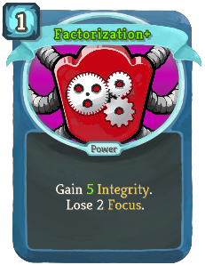 | Uncommon | Power | 1 | Gain 4(5) boosterpacks:Integrity. Lose 2 Focus. |
| Halting Problem | 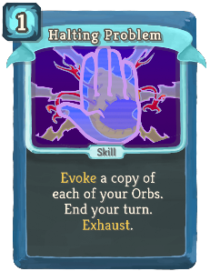 |  | Uncommon | Skill | 1 | Evoke a copy of each of your Orbs. End your turn. Exhaust. (not Exhaust.) |
| Multithreading |  |  | Uncommon | Power | 1 | (Innate.)  At the start of your turn, Evoke your rightmost Orb twice. |
| Optimize |  |  | Uncommon | Power | 1 | (Innate.)  At the beginning of your turn, apply 1 Lock-on to ALL enemies. |
| Piercing Claws |  |  | Uncommon | Attack | 1 | Deal 2(4) damage twice. Increases the damage of ALL Claw cards by 1 this combat. |
| Recursive Call |  |  | Uncommon | Power | 2(1) | Every time you play 4 cards in a turn, Channel a copy of your leftmost orb. |
| Register | 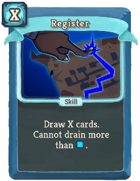 |  | Uncommon | Skill | X | Draw X (X+1) cards. Cannot drain more than [B]. |
| Static Wave |  |  | Uncommon | Skill | 0 | Activate the passive effect of each of your Orbs. Exhaust. (not Exhaust.) |
| Complex Plane | 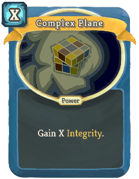 | 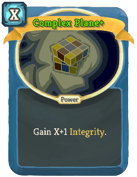 | Rare | Power | X | Gain X (X+1) boosterpacks:Integrity. |
| Galactic Algorithm |  |  | Rare | Skill | 3(2) | Gain 1 Orb Slot. Channel 1 Plasma. |
| Overflow |  |  | Rare | Skill | 4(3) | Fills your hand with copies of a card in your hand. Exhaust. |
| Paradigm Shift |  |  | Rare | Power | 2(1) | Lose all Focus. Gain double the boosterpacks:Integrity. |
| Twilight |  |  | Rare | Skill | 1 | boosterpacks:Latent. (not boosterpacks:Latent.) Channel 1 Dark per Orb slot. Exhaust. |
| Bravery |  |  | Common | Skill | 1(0) | Retain. Enter boosterpacks:Courage. Exhaust. |
| Dauntless |  |  | Common | Skill | 1 | Apply 2(3) Weak. If you are in boosterpacks:Courage, gain [W] and exit your Stance. |
| Empty Prediction |  |  | Common | Skill | 1 | Scry 4(5). Exit your Stance. |
| Friendship |  |  | Common | Skill | 0 | Retain. At the end of this turn, Retain your entire hand. Exhaust. (not Exhaust.) |
| Group Therapy |  |  | Common | Skill | 1 | ALL enemies lose HP equal to their *Mark. Apply 7(10) *Mark to ALL enemies. |
| Hate |  |  | Common | Attack | 1 | Deal 7(11) damage. If you are in Wrath, gain 1 Strength and exit your Stance. |
| Mind Over Matter |  |  | Common | Skill | 1 | Draw 3(4) cards. Discard 2 cards. Enter boosterpacks:Courage. |
| Pilgrimage |  |  | Common | Skill | 1 | (Retain.)  Gain 6 Mantra. End your turn. |
| Respite |  | 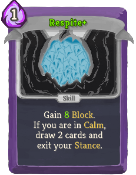 | Common | Skill | 1 | Gain 5(8) Block. If you are in Calm, draw 2 cards and exit your Stance. |
| Audacity |  |  | Uncommon | Skill | 0 | Draw 1 card. If you draw a Skill, enter boosterpacks:Courage. Exhaust. (not Exhaust.) |
| Augury |  |  | Uncommon | Skill | 1 | Gain 2(3) Mantra. Add 2 *Visions to your hand. |
| Defy Reality |  |  | Uncommon | Skill | 1 | Scry 5. Add 1(2) *Vision(s) to your hand. |
| Determination | 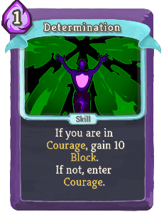 |  | Uncommon | Skill | 1 | If you are in boosterpacks:Courage, gain 10(15) Block. If not, enter boosterpacks:Courage. |
| Forge Reality |  |  | Uncommon | Attack | 2 | Deal 8(11) damage. Gain 8(11) Block. Add a *Smite and a *Safety to your hand. |
| Fortune |  |  | Uncommon | Skill | 0 | Retain. Scry 6(8). Exhaust. |
| Free Will |  |  | Uncommon | Skill | 1 | Scry 3(4). Draw as much cards as you discarded. |
| Naraka |  |  | Uncommon | Power | 1 | Whenever you change Stance, ALL enemies lose 5(7) HP. |
| Oracle |  |  | Uncommon | Power | 1 | (Innate.)  Whenever you Scry, Scry 1 more card. |
| Trinity |  |  | Uncommon | Attack | 0 | (Retain.)  Deal 7 damage. If you are in Divinity, deal triple damage and exit your Stance. |
| Valor |  |  | Uncommon | Skill | 1 | Scry 3(5). Draw 1 card. Enter boosterpacks:Courage. |
| Zen | 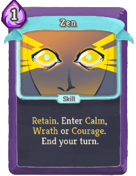 |  | Uncommon | Skill | 1(0) | Retain. Enter Calm, Wrath or boosterpacks:Courage. End your turn. |
| Collapse Reality |  | 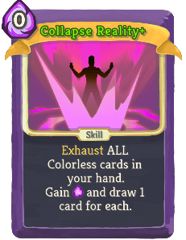 | Rare | Skill | 0 | Exhaust ALL Colorless cards in your hand. Gain [E] and draw 1 card for each. Exhaust. (not Exhaust.) |
| Encore |  |  | Rare | Power | 1 | (Innate.)  Whenever your turn is forced to end, draw 1 card, discard 2 cards and continue to play. |
| Prophecy | 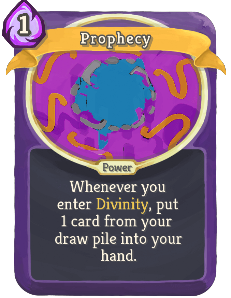 |  | Rare | Power | 1 | Whenever you enter Divinity, put 1(2) card(s) from your draw pile into your hand. |
| Reincarnation |  |  | Rare | Skill | X | Gain X (X+1) Strength. Gain X (X+1) Dexterity. End your turn. Exhaust. |
| Vision |  | 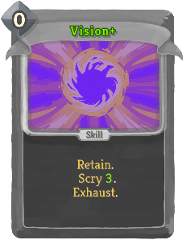 | Special | Skill | 0 | Retain. Scry 2(3). Exhaust. |
| Debris |  |  | Common | Status | 1 | Retain. Exhaust. |
| Breakthrough |  |  | Uncommon | Power | 2 | Gain 2(3) Strength. Gain 2(3) Dexterity. |
| Constant |  |  | Uncommon | Attack | 1 | Deal 6(9) damage. Gain 6(9) Block. Not affected by statuses. |
| Dignity |  |  | Uncommon | Attack | 1 | Can only be played if you have no *Rare card in hand. Deal 10(13) damage. Gain 4(6) Block. |
| Furtivity |  |  | Uncommon | Power | 0 | Gain 2(3) Dexterity. |
| Ire |  |  | Uncommon | Skill | 1 | Draw 2(3) cards. Enter Wrath. |
| Might |  | 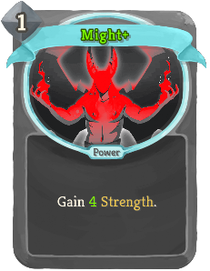 | Uncommon | Power | 1 | Gain 3(4) Strength. |
| Apocrypha |  |  | Rare | Skill | 2 | (Retain.)  Lose 7 HP. Enter Divinity. Exhaust. |
| Blessing |  |  | Rare | Power | 1(0) | boosterpacks:Latent. At the start of your turn, gain [E] . |
| Climax |  |  | Rare | Skill | 2 | boosterpacks:Latent. Play your next card three times. Exhaust. (not Exhaust.) |
| Monad |  |  | Rare | Attack | 2 | Deal 8(10) damage. Attack an additional time per *Rare card in your deck. |
| Transcendence |  |  | Rare | Skill | 2(1) | Ethereal. Double ALL your buffs and debuffs. Exhaust. |
