| Name | Image | Upgraded image | Rarity | Type | Cost | Description |
| ---- | ----- | -------------- | ------ | ---- | ---- | ----------- |
| Evasive Maneuver | 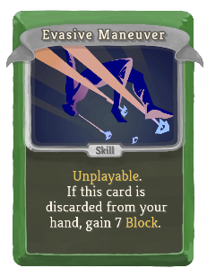 | 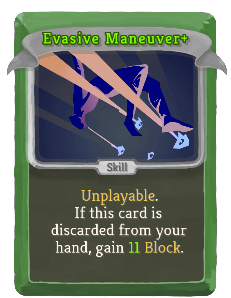 | Common | Skill |  | Unplayable. If this card is discarded from your hand, gain 7(11) Block. |
| Gut Stab | 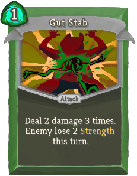 | 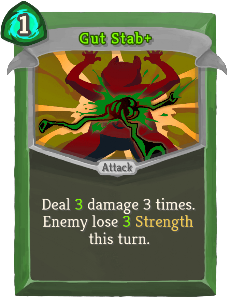 | Common | Attack | 1 | Deal 2(3) damage 3 times. Enemy lose 2(3) Strength this turn. |
| Hidden Strike | 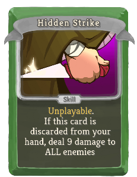 | 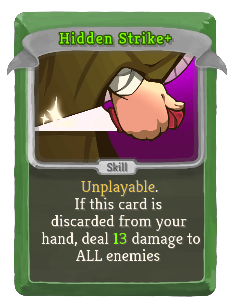 | Common | Skill |  | Unplayable. If this card is discarded from your hand, deal 9(13) damage to ALL enemies |
| Honed Blade | 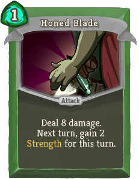 | 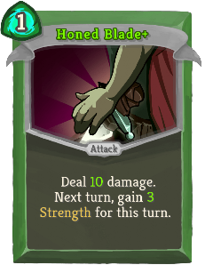 | Common | Attack | 1 | Deal 8(10) damage. Next turn, gain 2(3) Strength for this turn. |
| Instinct | 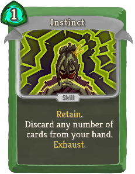 | 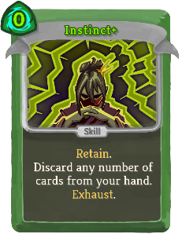 | Common | Skill | 1(0) | Retain. Discard any number of cards from your hand. Exhaust. |
| Killing Urge | 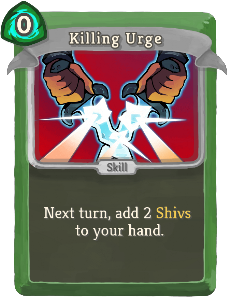 |  | Common | Skill | 0 | Next turn, add 2(3) Shivs to your hand. |
| Phantom Strike | 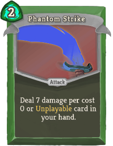 | 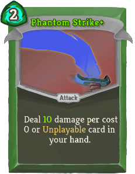 | Common | Attack | 2 | Deal 7(10) damage per cost 0 or Unplayable card in your hand. |
| Sliding Kick | 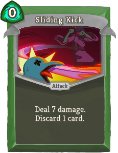 | 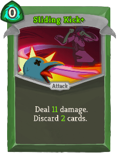 | Common | Attack | 0 | Deal 7(11) damage. Discard 1(2) card(s). |
| Ambivalent |  | 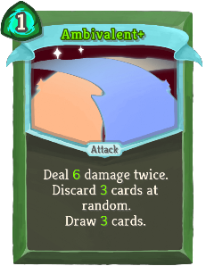 | Uncommon | Attack | 1 | Deal 5(6) damage twice. Discard 2(3) cards at random. Draw 2(3) cards. |
| Ambush | 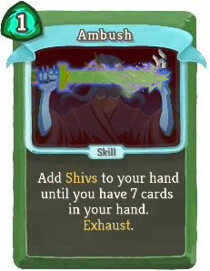 | 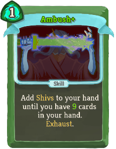 | Uncommon | Skill | 1 | Add Shivs to your hand until you have 7(9) cards in your hand. Exhaust. |
| Black Death | 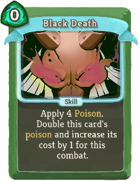 | 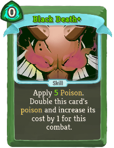 | Uncommon | Skill | 0 | Apply 4(5) Poison. Double this card's poison and increase its cost by 1 for this combat. |
| Corrosive Scent | 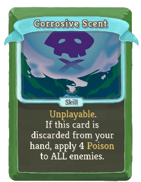 |  | Uncommon | Skill |  | Unplayable. If this card is discarded from your hand, apply 4(6) Poison to ALL enemies. |
| Cry Of Despair | 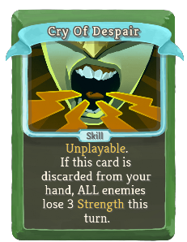 | 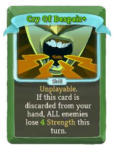 | Uncommon | Skill |  | Unplayable. If this card is discarded from your hand, ALL enemies lose 3(4) Strength this turn. |
| Ninjutsu | 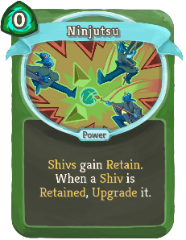 | 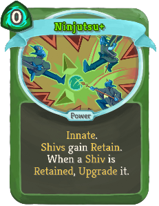 | Uncommon | Power | 0 | (Innate.)  Shivs gain Retain. When a Shiv is Retained, Upgrade it. |
| Secret Arsenal | 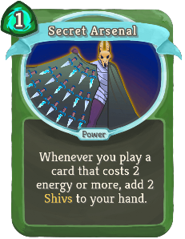 | 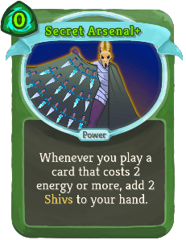 | Uncommon | Power | 1(0) | Whenever you play a card that costs 2 energy or more, add 2 Shivs to your hand. |
| Shinobi | 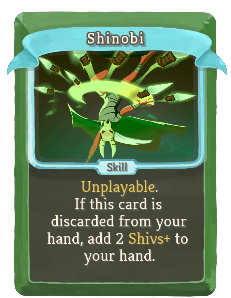 | 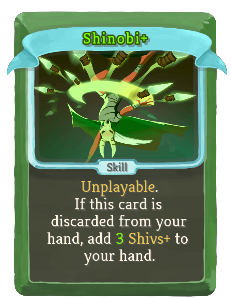 | Uncommon | Skill |  | Unplayable. If this card is discarded from your hand, add 2(3) Shivs+ to your hand. |
| Silence | 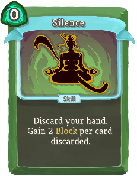 | 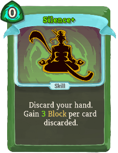 | Uncommon | Skill | 0 | Discard your hand. Gain 2(3) Block per card discarded. |
| Somber Omen | 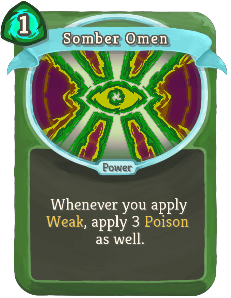 | 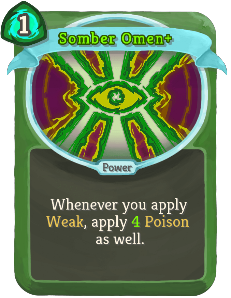 | Uncommon | Power | 1 | Whenever you apply Weak, apply 3(4) Poison as well. |
| Tactical Advantage | 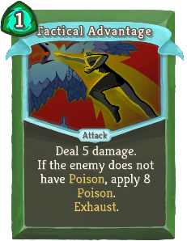 |  | Uncommon | Attack | 1 | Deal 5(6) damage. If the enemy does not have Poison, apply 8(10) Poison. Exhaust. |
| Assassinate | 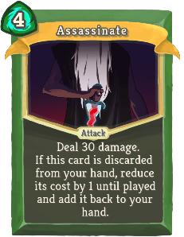 |  | Rare | Attack | 4(3) | Deal 30 damage. If this card is discarded from your hand, reduce its cost by 1 until played and add it back to your hand. |
| Master Trick | 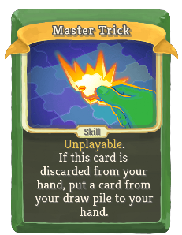 | 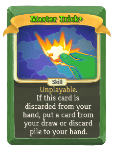 | Rare | Skill |  | Unplayable. If this card is discarded from your hand, put a card from your draw (or discard) pile to your hand. |
| Mastery | 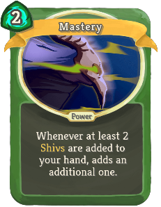 | 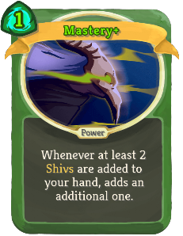 | Rare | Power | 2(1) | Whenever at least 2 Shivs are added to your hand, adds an additional one. |
| Mirage | 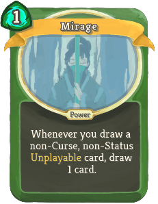 | 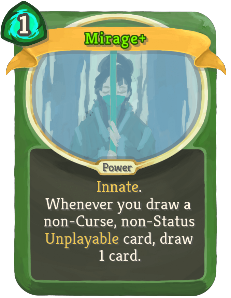 | Rare | Power | 1 | (Innate.)  Whenever you draw a non-Curse, non-Status Unplayable card, draw 1 card. |
| Shinigami | 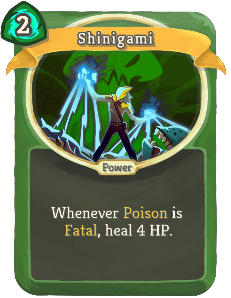 | 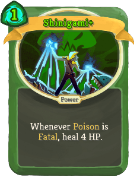 | Rare | Power | 2(1) | Whenever Poison is Fatal, heal 4 HP. |
| Underhanded Trick | 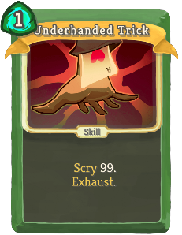 | 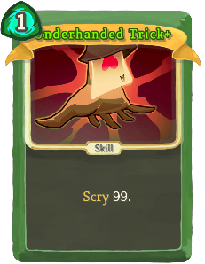 | Rare | Skill | 1 | Scry 99. Exhaust. (not Exhaust.) |
| Conductive Strike | 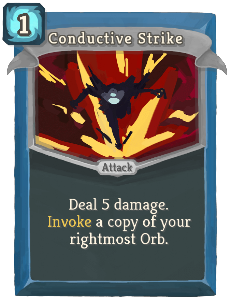 | 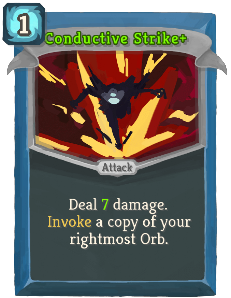 | Common | Attack | 1 | Deal 5(7) damage. boosterpacks:Invoke a copy of your rightmost Orb. |
| Dictionary Attack | 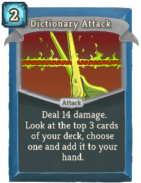 | 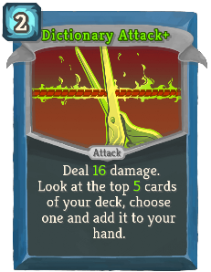 | Common | Attack | 2 | Deal 14(16) damage. Look at the top 3(5) cards of your deck, choose one and add it to your hand. |
| Matrix Inversion | 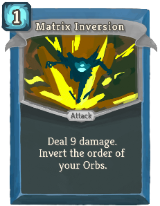 |  | Common | Attack | 1 | Deal 9(13) damage. Invert the order of your Orbs. |
| Nilpotency |  |  | Common | Skill | 1 | Put 2(3) cost 0 cards from your draw pile into your hand. |
| Pointer |  |  | Common | Skill | 0 | Evoke your leftmost Orb (twice). |
| Polynomial |  |  | Common | Attack | X | Deal 3(5) + 2(3)X damage to ALL enemies. Costs only up to [B] . |
| Swift Claw |  |  | Common | Attack | 0 | Deal 2(5) damage. Draw 1 card. |
| Targeting System |  |  | Common | Skill | 1 | Gain 7(11) Block. Apply 1 Lock-on. |
| Arctic Wind |  |  | Uncommon | Power | 1 | (Innate.)  At the beginning of your turn, Channel 1 Frost. |
| Black Hole |  |  | Uncommon | Power | 2(1) | Whenever a Dark is Evoked, trigger the passive ability of ALL Dark orbs. Channel 2 Dark. |
| Dark Mirror |  |  | Uncommon | Power | 1 | Gain 2(3) *Dark Focus. Channel 1 Dark. |
| Duck Typing |  |  | Uncommon | Skill | 1(0) | Evoke all Orbs of the same type as your rightmost one. Draw 1 card per Orb Evoked. |
| Factorization |  |  | Uncommon | Power | 1 | Gain 3(4) boosterpacks:Integrity. Lose 1 Focus. |
| Halting Problem |  |  | Uncommon | Skill | 1 | boosterpacks:Invoke a copy of each of your Orbs. End your turn. Exhaust. (not Exhaust.) |
| Multithreading |  |  | Uncommon | Power | 1 | (Innate.)  At the start of your turn, Evoke your rightmost Orb twice. |
| Optimize |  |  | Uncommon | Power | 1 | (Innate.)  At the beginning of your turn, apply 1 Lock-on to ALL enemies. |
| Piercing Claws |  |  | Uncommon | Attack | 1 | Deal 2(4) damage twice. Increases the damage of ALL Claw cards by 1 this combat |
| Recursive Call |  |  | Uncommon | Power | 2(1) | Every time you play 4 cards in a turn, Channel a copy of your leftmost orb. |
| Register |  |  | Uncommon | Skill | X | Draw X (X+1) cards. Costs only up to [B]. |
| Static Wave |  |  | Uncommon | Skill | 1 | Activate the passive effect of each of your Orbs. Exhaust. (not Exhaust.) |
| Complex Plane |  |  | Rare | Power | X | Gain X (X+1) boosterpacks:Integrity. Gain [B]. |
| Midnight |  |  | Rare | Attack | 2 | Deal 11(14) damage. Deal additional damage equal to half of (not half of)your next Dark Evoke value. |
| Overflow |  |  | Rare | Skill | 4(3) | Fills your hand with copies of a card in your hand. Exhaust. |
| Paradigm Shift |  |  | Rare | Power | 1 | Lose all Focus. Gain that much boosterpacks:Integrity. Gain 4(6) Integrity. |
| Twilight |  |  | Rare | Skill | 1 | boosterpacks:Latent. (not boosterpacks:Latent.) Channel 1 Dark per Orb slot. Exhaust. |
